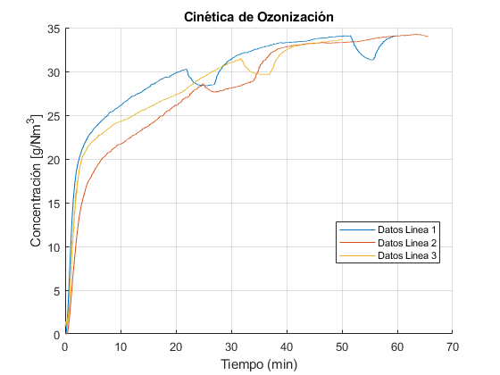
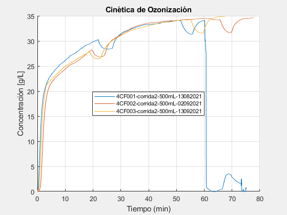
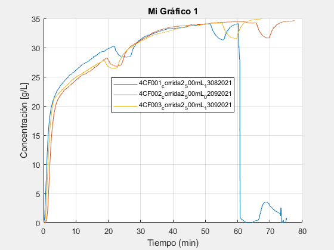
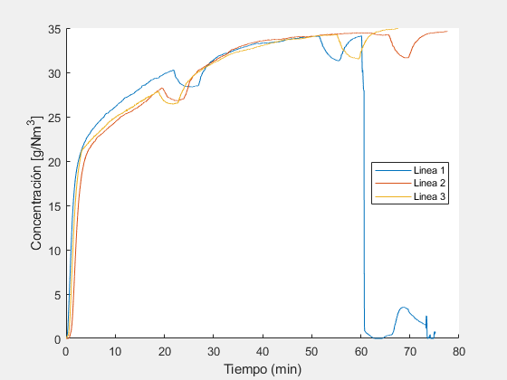
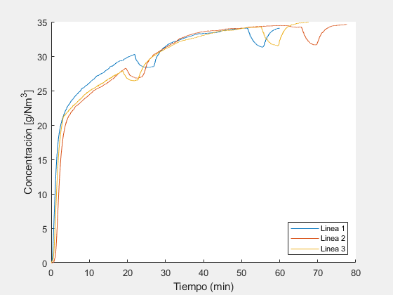
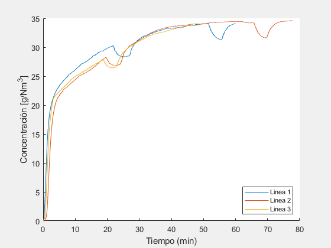
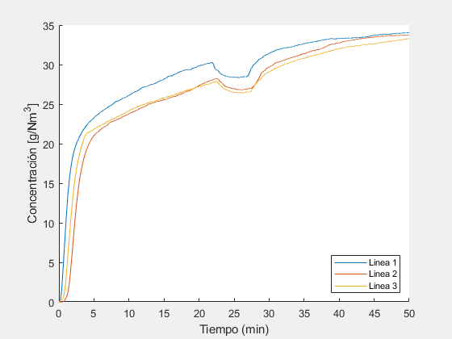
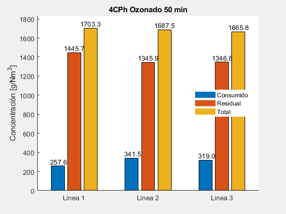

# LAIIQAToolbox


<!--  -->
[](https://la.mathworks.com/matlabcentral/fileexchange/120218-laiiqatoolbox)

# Novedades!

   - ***Propiedad*** `title` cambiada a \hyperref{BCD4EF66}{`fixedtitle`} para consistencia con los nombres de variable.
   - ***Propiedad*** \hyperref{A3381635}{`ozonetitle`} para el titulo del gráfico de barras de los cálculos de ozono.
   - ***Método*** \hyperref{A3381635}{`plotozonecalc`} para crear gráfico de barras de los resultados de ozono consumido, residual y total para cada línea de datos.
   -  Se pueden cerrar las ventanas de los gráficos.


# Descripción

**Matlab®** **toolbox** para ajustar y graficar los datos de los archivos `.mat` generados del proceso de ozonización en el Laboratorio de Investigación en Ingeniería Química Ambiental (LAIIQA) de ESIQIE - IPN.





# Requerimientos de Sistema

   -  MATLAB R2020b o posterior.
   -  *laiiqatoolbox*

# Instalación
### Métodos de instalación

   1.  Desde **Matlab**, ir a pestaña  **Home** > **Add-Ons** > **Get Add-Ons**, en el *Add-Ons Explorer* buscar como **laiiqatoolbox**.
   1.  Desde la página del proyecto en [GitHub - LAIIQAToolbox](https://github.com/TheBiotechScientist/LAIIQAToolbox), descargar el paquete **`laiiqatoolbox.mltbx`**, abrir **Matlab** (*opcional*) y, desde la ubicación del archivo, hacer doble click sobre él y seguir las indicaciones de instalación.

# Caracteristicas

   -  Programación orientada a objetos.
   -  Grafica datos ajustados (recortados) a una concentración inicial cero (o cercana).
   -  Acceso a propiedades de grafico: titulo, etiquetas de ejes ***x*** y ***y***, legenda, grosor de línea, etc.
   -  Conversión de datos de tiempo del eje ***x*** : `seg`, `min`, `h`.
   -  Multiselección de archivos para grafcar.
   -  Acceso a variables de datos crudos (`rawdata`) y ajustados (`fixeddata`).
   -  Cálculo de consumo de ozono.
   -  Acceso a variables de consumo de ozono (`ozoneresults`).
   -  Guardado de grafico en varios formatos: `png`, `jpg`, `jpeg`, `pdf`, `eps`, `svg`, `tif`, `fig`.
   -  Creación de varios objetos gráficos a la vez.
   -  Delimitación del tiempo total final, `xf`, para cada linea de datos.
   -  Posibilidad de ajustar el tiempo total desfazado de la cinética, multiplicando los datos de tiempo por una constante ***k***, con la propiedad `xk`.
   -  Representación gráfica del cálculo de consumo de ozono para cada linea de datos (gráfico de barras).

# Propiedades del objeto `laiiqatoolbox`

   -  `rawdata` : Datos "crudos", sin tratamiento, que contiene las filas de tiempo (1/100 ***seg***)  y concentración de ozono (***g/m^3***) del archivo `.mat`.
   -  `fixeddata` : Datos "ajustados", recortados para quitar los primeros datos de estabilización de la concentración de ozono y para comenzar el ozonograma desde una concentración igual o cercana a cero. Convierte los datos de tiempo a minutos por default.
   -  `fixedtitle` : Modifica o quita el título del gráfico de los datos ajustados. **Default**: `'Cinética de Ozonización'`.
   -  `ozonetitle` : Modifica o quita el título del gráfico de barras del consumo de ozono. **Default**: `"Consumo de Ozono"`.
   -  `xlabel` : Modifica los datos de tiempo. **Opciones**: `'min'` (default) | `'seg'` | `'h'`.
   -  `xk` : Multiplica los valores de tiempo, ***x***, de cada linea de datos por una constante ***k***.
   -  `xf` : Establece un valor final de tiempo, ***x final***, para cada linea de datos, de acuerdo a las unidades establecidas en  `xlabel`. **Opciones**: `'end'` (default) | `<x>` (cualquier valor de tiempo). Ejemplo: `miobjeto.xf = { 60 'end' 45 ...etc }`. Con `xlabel = 'min'`, `60` y `45` corresponden a minutos.
   -  `ylabel` : Cambia el titulo del eje ***y***. Default: `"Concentración [g/L]"`.
   -  `grid` : Activa o desactiva las rejillas del gráfico. **Opciones**: `'on'` (default) `|` `'off'` | `'minor'`.
   -  `LineWidth` :Cambia el grosor de linea para todas las lineas de datos. Default = `11`.
   -  `legend` : Cambia o quita la legenda para cada linea de datos. **Opciones**: `{'default'}` (default) | `{ "<nombre de leyenda 1>"  "<nombre de leyenda 2>"  ...etc }`. Ejemplo: `{'default'} `ó `{"Linea 1" "Linea 2" "Linea 3" ...etc }`. `default` pone de leyenda los nombres de archivos abiertos.
   -  `legendFontSize` : Cambia el tamaño de letra de todas las leyenda. Default = `8`.
   -  `legendLocation` : Ubicación de la leyenda en el gráfico. **Opciones**: `'best'` (default) | `'south'` | `'east'` | `'west'` | `'northeast'` | ...etc. Ver [documentación](https://la.mathworks.com/help/matlab/ref/matlab.graphics.illustration.legend-properties.html) para más opciones.
   -  `imageResolution` : Cambia la resolución de los formatos de imgen al guardar con el método `saveplot('nombre.ext')`. Default = `300`.
   -  `titleInterpreter` : Interprete utilizado para el renderizado del titulo. **Opciones**: `'tex'` (default)  | `'latex'`.
   -  `labelInterpreter` : Interprete utilizado para el renderizado del titulo de los ejes. **Opciones**: `'tex' (default) | 'latex'`.
   -  `legendInterpreter` : Interprete utilizado para el renderizado de las leyedas. **Opciones**: `'tex' (default) | 'latex'`.
   -  `ozoneUnits` : Unidades utilizadas para el cálculo del consumo de ozono. **Opciones**: `'g/L'` (default) | `'g/m^3'` | `'g/Nm^3'`.
   -  `ozoneresults` : Variable que almacena los calculos del consumo de ozono.

# Métodos del objeto `laiiqatoolbox`

   -  `openfiles` : Abre una ventana de dialogo para selececionar los archivos a graficar.
   -  `plotfiles` : Procesa los archivos seleccionados y crea el objeto gráfico de los datos ajustados.
   -  `plotozonecalc` : Crea un gráfico de barras con los resultados de ozono consumido, residual y total para cada línea de datos.
   -  `ozonecalc` : Procesa y calcula el ozono consumido, residual y total para cada línea de datos.
   -  `saveplot` : Guarda el objeto gráfico con el nombre y formato especificado. Ejemplo: `saveplot('nombre.pdf')`. **Parámetros**: `'fixed'` (default) | `'ozone'`. El parámetro `fixed` guarda el gráfico correspondiente a la cinética con los datos ajustados. El parámetro `ozone` guarda el gráfico de barras correspondiente al calculo de ozono.


# Guía de uso

Para un ejemplo más conciso revise el archivo [example.mlx](./example.mlx) de la documentación, localizado en la ruta de instalación, o en la pestaña de *Ejemplos* de la página principal de [laiiqatoolbox File-Exchange](https://la.mathworks.com/matlabcentral/fileexchange/120218-laiiqatoolbox).

## Creación del objeto

Inicializamos una instancia de objeto de tipo ***laiiqatoolbox***:

```matlab:Code
clearvars
close all
clc
miobjeto1 = laiiqatoolbox
```

```text:Output
miobjeto1 =
  laiiqatoolbox with properties:

              rawdata: []
            fixeddata: []
           fixedtitle: "Cinética de Ozonización"
           ozonetitle: "Consumo de Ozono"
           ozoneUnits: 'g/L'
               xlabel: 'min'
                   xk: {[1]}
                   xf: {'end'}
               ylabel: 'default'
                 grid: 'on'
            LineWidth: 0.5000
               legend: {'default'}
       legendFontSize: 8
       legendLocation: 'best'
      imageResolution: 300
     titleInterpreter: 'tex'
     labelInterpreter: 'tex'
    legendInterpreter: 'tex'
         ozoneresults: []

```

## Carga de archivos

Cargamos los archivos *.mat* generados por el ozonograma con el método `openfiles`:

```matlab:Code
miobjeto1.openfiles
```

```text:Output
ans =
  laiiqatoolbox with properties:

              rawdata: {[2x498709 double]  [2x500280 double]  [2x423437 double]}
            fixeddata: []
           fixedtitle: "Cinética de Ozonización"
           ozonetitle: "Consumo de Ozono"
           ozoneUnits: 'g/L'
               xlabel: 'min'
                   xk: {[1]  [1]  [1]}
                   xf: {'end'  'end'  'end'}
               ylabel: 'default'
                 grid: 'on'
            LineWidth: 0.5000
               legend: {'default'}
       legendFontSize: 8
       legendLocation: 'best'
      imageResolution: 300
     titleInterpreter: 'tex'
     labelInterpreter: 'tex'
    legendInterpreter: 'tex'
         ozoneresults: []

```

Como podemos observar las propiedades `rawdata`, `xk` y `xf` han cambiado de acuerdo a los datos cargados.

## Generación del gráfico

Graficamos los archivos cargados con el método `plotfiles`:

```matlab:Code
miobjeto1.plotfiles
```



```text:Output
ans =
  laiiqatoolbox with properties:

              rawdata: {[2x498709 double]  [2x500280 double]  [2x423437 double]}
            fixeddata: {[2x450938 double]  [2x466141 double]  [2x405324 double]}
           fixedtitle: "Cinética de Ozonización"
           ozonetitle: "Consumo de Ozono"
           ozoneUnits: 'g/L'
               xlabel: 'min'
                   xk: {[1]  [1]  [1]}
                   xf: {'end'  'end'  'end'}
               ylabel: 'default'
                 grid: 'on'
            LineWidth: 0.5000
               legend: {["4CF001-corrida2-500mL-13082021"]  ["4CF002-corrida2-500mL-02092021"]  ["4CF003-corrida2-500mL-13092021"]}
       legendFontSize: 8
       legendLocation: 'best'
      imageResolution: 300
     titleInterpreter: 'tex'
     labelInterpreter: 'tex'
    legendInterpreter: 'tex'
         ozoneresults: []

```

Ahora la propiedad `fixeddata` ha cambiado conteniendo los datos de `rawdata` modificados. Además la propiedad `legend` ahora contiene las leyendas con el nombre de cada archivo cargado.

## Modificando de las propiedades del objeto

Para modificar el titulo del gráfico:

```matlab:Code
miobjeto1.fixedtitle = 'Mi Gráfico 1'; % Con ; evitamos mostrar las propiedades del objeto
```

Para aplicar los cambios hechos a las propiedades ejecutamos el método `plotfiles` de nuevo:

```matlab:Code
miobjeto1.plotfiles; % Aplicamos los cambios
```



### Varios cambios a la vez

Quitamos el titulo del gráfico, cambiamos la etiqueta del eje ***y***, desactivamos las gradillas y cambiamos los nombres de las leyendas:

```matlab:Code
miobjeto1.fixedtitle = ''; % Quitamos titulo
miobjeto1.ozoneUnits = 'g/Nm^3'; % Cambiamos eje Y a 'Concentración [g/Nm^3]'
% y los calculos de ozono serán en g/Nm^3
miobjeto1.grid = 'off'; % Desactiva las rejillas
miobjeto1.legend = {'Linea 1' 'Linea 2' 'Linea 3'}; % Renombrado de leyendas
miobjeto1.plotfiles; % Aplicamos los cambios
```



## Uso de propiedad `xf`:

Como se observa en el gráfico anterior, los datos de la **Linea 1** terminan abruptamente después del minuto 60, para acotar los datos hasta el minuto 60, y quitar los restantes, modificamos el valor de *x* final de la **Linea 1** con la propiedad `xf`:

```matlab:Code
miobjeto1.xlabel = 'min'; % Primero establecemos las unidades de tiempo
miobjeto1.xf{1} = 60; % Asignamos un valor de xf = 60 minutos
miobjeto1.plotfiles; % Aplicamos los cambios
```



Cambiamos el valor de `xf` de la **Linea 3**:

```matlab:Code
miobjeto1.xf{3} = 62; % Asignamos un vamor xf = 61 minutos
miobjeto1.plotfiles; % Aplicamos los cambiamos
```



Para cambiar los 3 valores de `xf` al mismo tiempo:

```matlab:Code
miobjeto1.xf = {60 75 62}; % Asignamos un valor de 60 min
% a la Linea 1, 75 min a la Linea 2 y
% 62 min a la Linea 3
miobjeto1.plotfiles; % Aplicamos los cambios
```


## Utilizando el multiplicador de tiempo `xk`:

En ocasiones, cuando una cinética tardó 2 horas en realizarse, en los datos se registra como si hubiera durado 1 hora. Esto se debe a que tanto la señal de la concentración de ozono, como la velocidad de procesamiento de la computadora, llegan a tener un desface de tiempo en el registro de los datos. Para solucionar este fallo, se puede hacer uso de la propiedad `xk`, la cual multiplica los valores de tiempo (***x***) por una constante (***k***).

Para el gráfico anterior, modificaremos la **Línea 2** y **3** para hacerlas coincidir con la caída de concentración de la **Línea 1**.

```matlab:Code
miobjeto1.xf = {'end' 'end' 'end'}; % Primero establecemos los valores por default de xf
miobjeto1.xk = {1 1.15 1.20}; % La linea 1 se queda igual, aumentamos el tiempo de la
% linea 2 en un 15% y linea 3 un 20%
miobjeto1.xf = {50 50 50}; % Cortamos los datos de todas las lineas a 50 minutos máximo
miobjeto1.plotfiles; % Aplicamos los cambios
```


## Cálculo de consumo de ozono

Una vez ejecutados los métodos `openfiles` y `plotfiles` se puede ejecutar el método `ozonecalc`:

```matlab:Code
miobjeto1.ozonecalc;
```

```text:Output
Para Linea 1:
    Consumido: 257.632 g/Nm^3
    Residual: 1445.716 g/Nm^3
    Total: 1703.348 g/Nm^3 en 50 min

Para Linea 2:
    Consumido: 341.5357 g/Nm^3
    Residual: 1345.9476 g/Nm^3
    Total: 1687.4833 g/Nm^3 en 50 min

Para Linea 3:
    Consumido: 318.9756 g/Nm^3
    Residual: 1346.84 g/Nm^3
    Total: 1665.8156 g/Nm^3 en 50 min
```

## Gráfico de consumo de ozono

Al igual que `ozonecalc`, una vez ejecutados los métodos `openfiles` y `plotfiles` se puede mostrar gráficamente el cálculo de consumo de ozono al ejecutar el método `plotozonecalc`.

***Nota*** : Los cambios aplicados por `plotfiles` a las propiedades tales como `xf`, `xk`, `xlabel`, `ozoneUnits`, `ylabel` y `grid`, afectan directamente a la propiedad `fixeddata`, la cual es necesaria para el cálculo de ozono consumido, residual y total, y por lo tanto afectan los resultados de los métodos `ozonecalc` y `plotozonecalc`.

```matlab:Code
miobjeto1.ozonetitle = '4CPh Ozonado 50 min'; % Cambiamos el titulo del
% gráfico de barras. Default = 'Consumo de Ozono'
miobjeto1.plotozonecalc; % Aplicamos los cambios y creamos el gráfico
```


## Exportar imagen de los objetos gráficos
### Métodos para guardar la imagen del gráfico

   1.  **Desde la ventana del gráfico**: Nos dirigimos a la pestaña ***File*** > ***Save As*** > *En la ventana de diálogo escribir un nombre y seleccionar la ruta* > ***Guardar***.

   2.  **De manera programática**: Para guardar la imagen del objeto gráfico, utilizamos el método `saveplot('nombre.ext','object')`. Donde `ext` es uno de los formatos válidos (*png*, *jpg*, *jpeg*, *bmp*, *pdf*, *eps*, *svg*, *tif*, *fig*) y `object` es el objeto gráfico que se desea guardar: `'fixed'` (default) guarda la cinética y `'ozone'` guarda el gráfico de barras del cálculo de ozono.  

***Nota***: La ventaja del **método** **2** es que se pueden guardar todos los objetos gráficos a la vez sin necesidad de ir a cada ventana.

Para guardar la imagen de la cinética con los datos ajustados, basta con escribir el nombre y la extensión. No es necesario escribir el parámetro `'fixed'`.

```matlab:Code
miobjeto1.imageResolution = 600; % Resolución de imagen, default = 300
miobjeto1.saveplot('ozonograma1.png'); % Nombre y extensión del archivo
```



***Nota***: Para guardar en ***formato vectorial*** (*pdf*, *eps*, *svg*) no es necesario modificar la resolución:

```matlab:Code
miobjeto1.saveplot('ozonograma1.pdf');
```


Para guardar el gráfico de barras, añadimos al nombre y extensión, separado por coma, el parámetro `'ozone'`.

```matlab:Code
miobjeto1.saveplot('consumo1.png','ozone');
```



***
*Generated from GettingStarted.mlx with [Live Script to Markdown Converter](https://github.com/roslovets/Live-Script-to-Markdown-Converter)*
