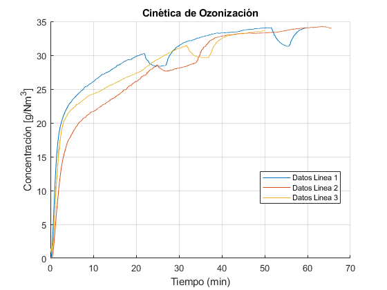
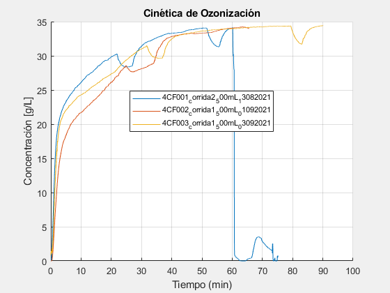
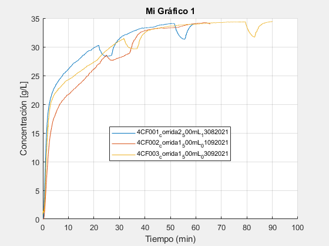
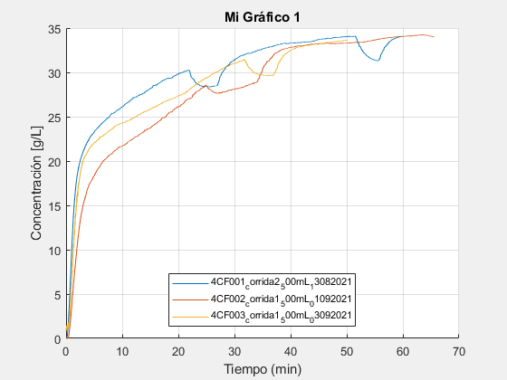
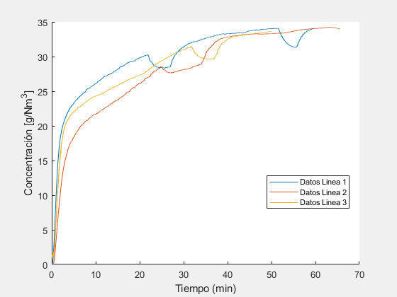

# LAIIQAToolbox
### v1.1


## Descripción

Programa para ajustar y graficar los datos de los archivos `.mat` generados del proceso de ozonización en el Laboratorio de Investigación en Ingeniería Química Ambiental (LAIIQA) de ESIQIE - IPN.





## Requerimientos de Sistema
Matlab >= R2019.


## Instalación

Desde **Add-Ons** en la pestaña **Home**, buscar como **laiiqatoolbox**.


## Características

   -  Programación orientada a objetos.
   -  Grafica datos ajustados (recortados) a una concentración inicial cero (o cercana).
   -  Acceso a propiedades de grafico: titulo, etiquetas de ejes *x* y *y, *legenda, tamaño, etc.
   -  Conversión de datos de tiempo del eje *x: *seg, min, h.
   -  Multiselección de archivos para grafcar.
   -  Acceso a variables de datos crudos (`rawdata`) y ajustados (`fixeddata`).
   -  Calculo de consumo de ozono.
   -  Acceso a variables de consumo de ozono (`ozoneresults`).
   -  Guardado de grafico en varios formatos: png, jpg, jpeg, pdf, eps, svg, tif, fig.
   -  Creación de varios objetos gráficos a la vez.

## Propiedades del objeto `laiiqatoolbox`

   -  `rawdata` : Datos "crudos", sin tratamiento que contiene las filas de tiempo y concentración de ozono del archivo `.mat`.
   -  `fixeddata` : Datos "ajustados", recortados para quitar los primeros datos de estabilización de la concentración de ozono y para comenzar el ozonograma desde una concentración igual o cercana a cero.
   -  `title` : Modifica o quita el titulo del gráfico.
   -  `xlabel` : Modifica los datos de tiempo. Opciones: `'seg'` | `'min'` | `'h'`.
   - `xf` : Establece el valor de *x* final para cada linea de datos. Ociones: `'end'` (para restaurar a todos los valores) | `<valor numerico>` (cualquier valor positivo de tiempo). Ejemplo: `miobjeto.xf = { 28 'end' 45 'end' ...etc }`.
   -  `ylabel` : Cambia el titulo del eje *y*.
   -  `grid` : Activa o desactiva las rejillas del gráfico. Opciones: `'on'` | `'off'`.
   - `LineWidth` : Cambia el grosor de linea para todas las lineas de datos.
   - `legend` : Cambia o quita la legenda para cada linea de datos. Opciones: `'default'` (pone de leyenda los nombres de archivos abiertos) | `{"<nombre de leyenda 1>"  "<nombre de leyenda 2>" ...etc }`. Ejemplo: `{'default'}` ó `{"Linea 1" "Linea 2" "Linea 3" ...etc }`.
   - `legendFontSize` : Cambia el tamaño de letra de todas las leyenda.
   - `legendLocation` : Ubicación de la leyenda en el gráfico. Opciones:  `'south'` | `'east'` | `'west'` | `'northeast'` | `...etc`. Ver [documentación](https://la.mathworks.com/help/matlab/ref/matlab.graphics.illustration.legend-properties.html) para más opciones.
   - `imageResolution` : Cambia la resolución de los formatos de imgen al guardar con el método `saveplot()`.
   -  `titleInterpreter  :`Interprete utilizado para el renderizado del titulo. Opciones: `'tex'` (default) | `'latex'`.
   -  `labelInterpreter  :`Interprete utilizado para el renderizado del titulo de los ejes. Opciones: `'tex'` (default) | `'latex'`.
   -  `legendInterpreter  :`Interprete utilizado para el renderizado de las leyedas. Opciones: `'tex'` (default) | `'latex'`.
   -  `ozoneUnits` : Unidades utilizadas para el cálculo del consumo de ozono.
   -  `ozoneresults` : Variable que almacena los calculos del consumo de ozono.

## Métodos del objeto `laiiqatoolbox`

   -  `openfiles` : Abre una ventana de dialogo para selececionar los archivos a graficar.
   -  `plotfiles` : Procesa los archivos seleccionados y crea el objeto gráfico.
   -  `saveplot` : Guarda el objeto gráfico con el nombre y formato especificado. Ejemplo: `saveplot('nombre.pdf')`.
   -  `ozonecalc` : Procesa los datos de cada archivo y calcula el ozono consumido, residual y total.

# Ejemplos
## Creación del objeto

Inicializamos una instancia de objeto de tipo ***laiiqatoolbox***:


```matlab:Code
clearvars
close all
clc
miobjeto1 = laiiqatoolbox
```


```text:Output
miobjeto1 =
  laiiqatoolbox with properties:

              rawdata: []
            fixeddata: []
                title: "Cinética de Ozonización"
               xlabel: 'min'
                   xf: {'end'}
               ylabel: "Concentración [g/L]"
                 grid: 'on'
            LineWidth: 0.5000
               legend: {'default'}
       legendFontSize: 8
       legendLocation: 'best'
      imageResolution: 300
     titleInterpreter: 'tex'
     labelInterpreter: 'tex'
    legendInterpreter: 'tex'
           ozoneUnits: 'g/L'
         ozoneresults: []

```

## Carga de archivos

Cargamos los archivos *.mat* a graficar generados por el ozonograma con el método `openfiles`:


```matlab:Code
miobjeto1.openfiles
```

```text:Output
ans =
  laiiqatoolbox with properties:

              rawdata: {[2x498709 double]  [2x421267 double]  [2x568493 double]}
            fixeddata: []
                title: "Cinética de Ozonización"
               xlabel: 'min'
                   xf: {'end'  'end'  'end'}
               ylabel: "Concentración [g/L]"
                 grid: 'on'
            LineWidth: 0.5000
               legend: {'default'}
       legendFontSize: 8
       legendLocation: 'best'
      imageResolution: 300
     titleInterpreter: 'tex'
     labelInterpreter: 'tex'
    legendInterpreter: 'tex'
           ozoneUnits: 'g/L'
         ozoneresults: []

```

## Creación del gráfico

Graficamos los archivos cargados con el método `plotfiles`:


```matlab:Code
miobjeto1.plotfiles
```





```text:Output
ans =
  laiiqatoolbox with properties:

              rawdata: {[2x498709 double]  [2x421267 double]  [2x568493 double]}
            fixeddata: {[2x450938 double]  [2x393631 double]  [2x540614 double]}
                title: "Cinética de Ozonización"
               xlabel: 'min'
                   xf: {'end'  'end'  'end'}
               ylabel: "Concentración [g/L]"
                 grid: 'on'
            LineWidth: 0.5000
               legend: {["4CF001_corrida2_500mL_13082021"]  ["4CF002_corrida1_500mL_01092021"]  ["4CF003_corrida1_500mL_03092021"]}
       legendFontSize: 8
       legendLocation: 'best'
      imageResolution: 300
     titleInterpreter: 'tex'
     labelInterpreter: 'tex'
    legendInterpreter: 'tex'
           ozoneUnits: 'g/L'
         ozoneresults: []

```

## Moficación de las propiedades del objeto

Para modificar el titulo del gráfico:


```matlab:Code
miobjeto1.title = 'Mi Gráfico 1'
```


```text:Output
miobjeto1 =
  laiiqatoolbox with properties:

              rawdata: {[2x498709 double]  [2x421267 double]  [2x568493 double]}
            fixeddata: {[2x450938 double]  [2x393631 double]  [2x540614 double]}
                title: 'Mi Gráfico 1'
               xlabel: 'min'
                   xf: {'end'  'end'  'end'}
               ylabel: "Concentración [g/L]"
                 grid: 'on'
            LineWidth: 0.5000
               legend: {["4CF001_corrida2_500mL_13082021"]  ["4CF002_corrida1_500mL_01092021"]  ["4CF003_corrida1_500mL_03092021"]}
       legendFontSize: 8
       legendLocation: 'best'
      imageResolution: 300
     titleInterpreter: 'tex'
     labelInterpreter: 'tex'
    legendInterpreter: 'tex'
           ozoneUnits: 'g/L'
         ozoneresults: []

```

### Ajuste de *x* final para cada linea de datos

Cambiamos el valor de *x* final de la primer linea de datos con la propiedad `xf:`


```matlab:Code
miobjeto1.xf{1} = 60 % Asignamos el valor (en unidades de tiempo) de xf para la primer linea de datos.
```

```text:Output
miobjeto1 =
  laiiqatoolbox with properties:

              rawdata: {[2x498709 double]  [2x421267 double]  [2x568493 double]}
            fixeddata: {[2x450938 double]  [2x393631 double]  [2x540614 double]}
                title: 'Mi Gráfico 1'
               xlabel: 'min'
                   xf: {[60]  'end'  'end'}
               ylabel: "Concentración [g/L]"
                 grid: 'on'
            LineWidth: 0.5000
               legend: {["4CF001_corrida2_500mL_13082021"]  ["4CF002_corrida1_500mL_01092021"]  ["4CF003_corrida1_500mL_03092021"]}
       legendFontSize: 8
       legendLocation: 'best'
      imageResolution: 300
     titleInterpreter: 'tex'
     labelInterpreter: 'tex'
    legendInterpreter: 'tex'
           ozoneUnits: 'g/L'
         ozoneresults: []

```

Para aplicar los cambios echos a las propiedades ejecutamos el método `plotfiles` de nuevo:


```matlab:Code
miobjeto1.plotfiles; % Con ; evitamos mostrar las propiedades  en el Command Window
```




Cambiamos el tercer valor de `xf`:


```matlab:Code
miobjeto1.xf{3} = 50; % Asignamos un vamor de 50 minutos a la tercera linea de datos.
miobjeto1.plotfiles; % Aplicamos los cambiamos al gráfico.
```




Para cambiar los 3 valores de `xf `al mismo tiempo:


```matlab:Code
miobjeto1.xf = {60 'end' 50}; % Asignamos un valor de 60 min
% a la primer linea de datos, todos los datos a la linea 2 y
% 50 min a la linea 3.
miobjeto1.plotfiles; % Aplicamos los cambios al gráfico.
```


Quitamos el titulo del gráfico, cambiamos la etiqueta del eje *y*, desactivamos las gradillas y cambiamos los nombres de las leyendas:


```matlab:Code
miobjeto1.title = ''; % Quitamos titulo
miobjeto1.ylabel = 'Concentración [g/Nm^3]'; % Cambio de g/L a g/Nm^3
miobjeto1.grid = 'off'; % Desactiva las rejillas
miobjeto1.legend = {'Datos Linea 1' 'Datos Linea 2' 'Datos Linea 3'}; % Renombrado de leyendas
miobjeto1.plotfiles; % Aplicamos los cambios
```



## Calculo del consumo de ozono

Una vez ejecutados los métodos `openfiles` y `plotfiles` se puede ejecutar el método `ozonecalc`:


```matlab:Code
miobjeto1.ozonecalc;
```

```text:Output
Para Datos Linea 1:
    Consumido: 1.775 g/L
    Residual: 0.27064 g/L
    Total: 2.0456 g/L

Para Datos Linea 2:
    Consumido: 1.8347 g/L
    Residual: 0.41338 g/L
    Total: 2.2481 g/L

Para Datos Linea 3:
    Consumido: 1.3811 g/L
    Residual: 0.30163 g/L
    Total: 1.6828 g/L
```
